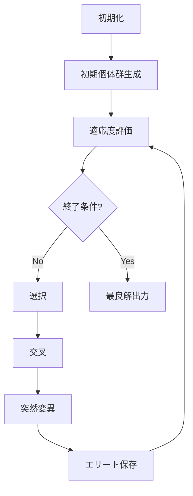

# 遺伝的アルゴリズム（GA）によるジョブショップスケジューリング - アルゴリズム概要

## 目次
1. [問題定義](#問題定義)
2. [GAアプローチの概要](#gaアプローチの概要)
3. [アルゴリズムフロー](#アルゴリズムフロー)
4. [特徴と利点](#特徴と利点)

## 問題定義

### ジョブショップスケジューリング問題（JSP）とは

本実装が解決する問題は、複数の**タスク**を複数の**リソース（作業者・設備）**に割り当て、全体の完了時間（メイクスパン）を最小化する組合せ最適化問題です。

#### 問題の要素

1. **タスク** (`task-0000` ~ `task-xxxx`)
   - 各タスクには所要時間が設定
   - 特定の作業者と設備の組み合わせでのみ実行可能

2. **リソース**
   - **作業者**: `rsrc-0001` ~ `rsrc-0007` + ダミー
   - **設備**: `rsrc-0008` ~ `rsrc-0067` + ダミー

3. **制約条件**
   - **割り当て制約**: 各タスクは許可された作業者・設備の組み合わせでのみ実行可能
   - **順序制約**: タスク間の先行・後続関係（時間差下限制約付き）
   - **リソース制約**: 同一リソースは同時に1つのタスクのみ処理可能

### 最適化目標

**メイクスパン（全タスクの完了時間）の最小化**

```
Minimize: max(task.end_time for all tasks)
```

## GAアプローチの概要

### なぜGAを選択したか

1. **NP困難問題への対応**
   - 厳密解法では計算時間が指数的に増加
   - GAは準最適解を実用的な時間で発見

2. **複雑な制約の柔軟な扱い**
   - ペナルティ関数により制約違反を段階的に解消
   - ハード制約とソフト制約の両立が可能

3. **並列化の容易さ**
   - 個体群ベースのアプローチで並列計算が自然に実装可能

### GA用語と本問題での対応

| GA用語 | 本問題での意味 | 具体例 |
|--------|--------------|---------|
| **染色体（個体）** | スケジュール全体 | タスクの実行順序とリソース割り当て |
| **遺伝子** | 1つのタスク割り当て | `{task: 'task-0001', worker: 'rsrc-0002', equipment: 'rsrc-0010'}` |
| **個体群** | 複数のスケジュール候補 | 50個の異なるスケジュール案 |
| **適応度** | スケジュールの良さ | メイクスパン + 制約違反ペナルティ |
| **世代** | 最適化の反復回数 | 500世代で進化 |

## アルゴリズムフロー

### 全体の流れ



### 詳細なステップ

#### 1. 初期化フェーズ

```python
# データ読み込み
- Excelファイルから4つのシートを読み込み
  - リソース情報
  - タスク情報
  - 割り当て可能パターン
  - 順序制約

# パラメータ設定
- population_size: 50 (個体群サイズ)
- crossover_rate: 0.8 (交叉確率)
- mutation_rate: 0.3 (突然変異確率)
- elite_rate: 0.1 (エリート保存率)
- num_generations: 500 (世代数)
```

#### 2. 初期個体群生成

```python
for i in range(population_size):
    1. トポロジカルソートでタスク順序を決定
    2. 各タスクに有効なリソースをランダム割り当て
    3. 染色体として個体群に追加
```

#### 3. 進化ループ（メインループ）

```python
for generation in range(num_generations):
    1. 適応度評価（全個体）
    2. エリート個体の保存
    3. 選択（トーナメント選択）
    4. 交叉（順序交叉 OX）
    5. 突然変異（タスク入れ替え＋リソース再割り当て）
    6. 次世代の構成
```

#### 4. 適応度評価の詳細

```python
fitness = makespan + penalty

where:
    makespan = 全タスクの最大終了時刻
    penalty = Σ(制約違反量 × ペナルティ係数)
```

### 収束の仕組み

1. **探索と活用のバランス**
   - 序盤: 高い突然変異率で広域探索
   - 終盤: エリート保存で良解の活用

2. **多様性の維持**
   - トーナメント選択で適度な選択圧
   - 突然変異で局所最適からの脱出

3. **制約充足の段階的改善**
   - ペナルティ関数により制約違反が徐々に減少
   - 実行可能解への収束を保証

## 特徴と利点

### 本実装の強み

1. **制約の柔軟な扱い**
   - 複雑な時間差下限制約に対応
   - 割り当て可能パターンの厳密な遵守

2. **スケーラビリティ**
   - タスク数100以上でも実用的な時間で解を取得
   - 並列化による更なる高速化が可能

3. **解の品質保証**
   - エリート戦略により最良解を保持
   - 制約充足と最適化の両立

### 計算複雑度

| 操作 | 時間計算量 | 説明 |
|------|-----------|------|
| 適応度評価 | O(n²) | n: タスク数 |
| 選択 | O(p) | p: 個体群サイズ |
| 交叉 | O(n) | n: タスク数 |
| 突然変異 | O(1) | 定数時間 |
| **全体** | **O(g × p × n²)** | g: 世代数 |

### 期待される性能

- **小規模（30タスク）**: 10-20秒で良解
- **中規模（50タスク）**: 30-60秒で良解
- **大規模（100タスク）**: 2-5分で実用解

## 次のステップ

詳細な実装については以下のドキュメントを参照:
- [実装詳細](./ga_implementation_details.md)
- [問題固有の工夫](./problem_specific_optimizations.md)
- [データ構造と制約処理](./data_structures_constraints.md)